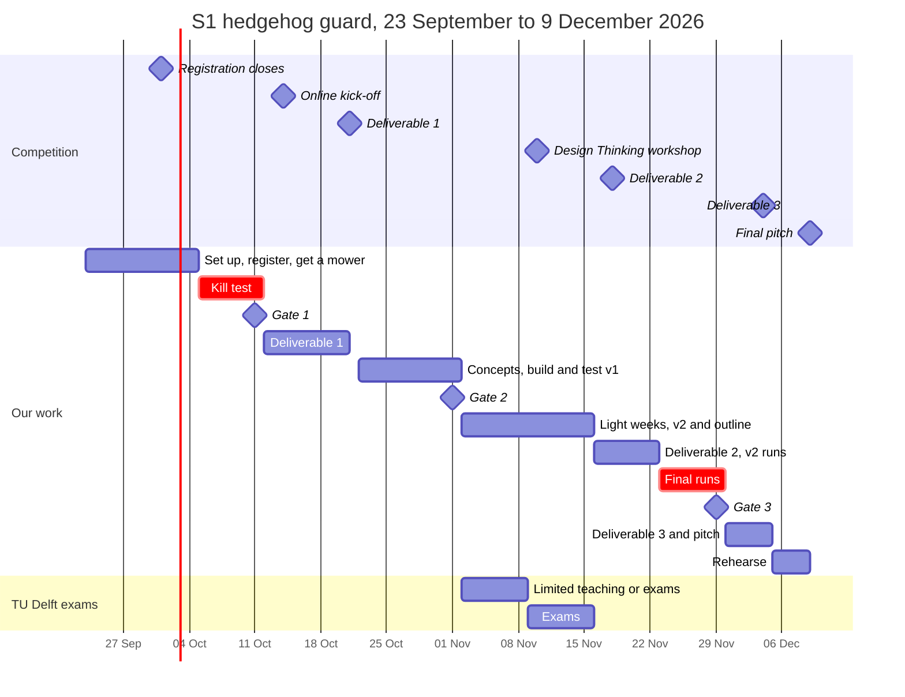

# S1 hedgehog guard: the idea worked out, and the plan to 9 December

*Written 23 September 2026. Competition dates are read from
`../Resources/competition-brief-2026-09-23.md`. The full evidence is in
`deep-dive-mechanical-options-2026-09-23.md`; this file repeats only what the plan needs.*

**Status: lead idea, not a team decision.** The plan opens with a one-weekend kill test, so
we know by Sunday 11 October, before the kick-off, whether S1 holds up. Nothing in this file
has been tested yet.

## In one minute

- **What we build:** a clip-on guard for robot mowers that only notice obstacles by bumping
  into them. It makes the mower notice a young hedgehog before the blades reach it, with no
  wiring into the mower, and the mower still docks.
- **What we want to prove:** on the safety test that hedgehog researchers proposed in 2024,
  the stock mower fails with the small dummy and the guarded mower passes (only damage
  categories 0 to 2, see 1.7).
- **Why it could be new:** brands are putting cameras on new models. We found no
  tested mechanical fix for the mowers already in gardens (a quick search only; the proper
  check is step 9).
- **What decides it first:** one comparison, in the week of 5 October: the force the mower
  needs to register a bump, against the force that slides a small hedgehog dummy away.
- **The time:** 11 weeks and 7 fixed dates. Deliverable 1 is due one week after the
  kick-off, and TU Delft exams fall in the two weeks before deliverable 2, so the heavy
  building happens in October.

## Part 1. The idea, worked out

### 1.1 The problem, in the numbers the pitch will use

| Claim | Source |
| :-- | :-- |
| Aalborg tested 18 robot mowers with dead hedgehogs, each with a 3 m run-up. None detected the dependent juveniles under 200 g; these often passed under the blades without visible injury | Rasmussen et al. 2021 |
| In a follow-up with 19 models, apart from one single case no mower detected a hedgehog without touching it. Height was the size measure that most influenced injury: larger hedgehogs were injured less | Rasmussen et al. 2024 |
| Skid plates, pivoting blades and front-wheel drive were linked to less damage | Rasmussen et al. 2021 |
| The Husqvarna mowers in that test drove at 21 to 39 m per minute, which is 0.35 to 0.65 m/s | Rasmussen et al. 2021 |
| In Germany, 370 hedgehogs injured by garden tools were recorded from June 2022 to September 2023, and 47% died | Leibniz-IZW |
| The European hedgehog has been Near Threatened on the IUCN Red List since 29 October 2024 | Hedgehog Street |
| Wallonia bans robot mowers from 18:00 to 9:00 since 9 April 2026. The Netherlands has no such rule | Walloon environment department; NOS |
| Young hedgehogs are born in late summer and early autumn. Hibernation usually runs from October or November to March or April | Egelbescherming Nederland |

Our reading of the two studies, not a finding of the papers: the smallest hedgehogs can slip
under the blades, the big ones get bumped, and the ones in between get hit. The small dummy
in the proposed test (7 cm high) sits in that band.

Not established, so never said as fact: how many hedgehogs mowers injure in the Netherlands
each year, and how many contact-only mowers run in Dutch gardens (see 1.10).

### 1.2 Who it is for

- **Owners of contact-only mowers already in their garden:** they want a mower that works
  and no dead hedgehogs, without buying a new mower. Whether they would fit a guard, and at
  what price, is an **assumption** (owner survey, steps 23 and 25).
- **Hedgehog organisations** (Egelbescherming Nederland, local shelters): today they advise
  mowing only by day. A tested guard would give them a second message. Whether they would
  back it is an **assumption** (step 4).
- **Researchers and mower makers** (Aalborg and Oxford; IZW and the crash-test firm CTS in
  Germany, who are working towards a standard): our test data are useful to them even if
  nobody ever sells our guard.

### 1.3 What we build

A light guard that clips onto the mower's body shell at the front and front corners. On
contact-only mowers the shell floats on the chassis, and moving it trips the collision
sensor (deep dive; to confirm for our model in step 6). The guard closes the gap under the
front edge, where a 7 cm hedgehog now slips under, and turns a small push low down into a
bump the mower already knows how to handle: stop, reverse, turn.

**First platform: a used Husqvarna Automower 105.** It is a common entry model. One
Marktplaats search on 23 September showed used ones asking €75 to €500, most between €100
and €300. A common model also means many possible users and cheap spare parts.

### 1.4 Requirements

| # | Requirement | Target | Where the number comes from |
| :-- | :-- | :-- | :-- |
| R1 | Small dummy: 7 cm high, under 400 g | Damage categories 0 to 2 in 60 of 60 trials | The 2024 protocol and its labelling rule |
| R2 | Large dummy: at least 10 cm high, over 600 g | Categories 0 to 2 in 60 of 60 trials | Same |
| R3 | Do no harm to the smallest: a tiny dummy of about 5 cm and 180 g | No more category 3 or 4 than the stock mower | Our own addition. The 5 cm is an **assumption** until a shelter confirms it |
| R4 | Still docks | 10 of 10 dockings | A German sheet-metal guard on an Automower 450X failed on exactly this (robomaeher.de) |
| R5 | No extra stops on real grass | No more stops per 30 minutes than the stock mower | Our target |
| R6 | Fits without tools or wiring, and comes off in a minute | Yes or no | Our target: a retrofit has to be easy |
| R7 | Works at the mower's own speed | Tested at stock speed | 0.35 to 0.65 m/s for Husqvarna models (Rasmussen 2021) |
| R8 | Material cost | Under €15 | **Assumption**, our guess at what owners would accept; the survey tests it |

### 1.5 The physics we have to beat

Two numbers decide the concept. We measure both in the week of 5 October (step 13):

1. **Trigger force:** how hard you must push the shell, at 3, 5 and 7 cm above the ground,
   before the mower registers a bump. A luggage scale or a kitchen scale is enough.
2. **Slide force:** how hard you must push each dummy on the test surface before it slides.
   Our estimate, not a measurement: with a friction coefficient of 0.3 to 0.6, about 0.5 to
   1 N for 180 g and 1 to 2 N for 350 g.

If the trigger force is higher than the slide force, a stiff guard shoves the dummy ahead
until the mower rolls over it (category 3 or 4). The guard then has to multiply force
(concept B) or bring its own trigger (concept C).

A third number sets how far ahead the guard must reach. At 0.35 to 0.65 m/s the mower
travels 3.5 to 6.5 cm for every 0.1 s it takes to react. We film the stop in slow motion,
measure the reaction time and the stopping distance, and make the guard touch the dummy at
least that far ahead of the blade disc.

### 1.6 Four concept directions

| Concept | How it works | Why it might work | Main risk | First test |
| :-- | :-- | :-- | :-- | :-- |
| **A. Low apron** | A flexible skirt (TPU flaps or a brush strip) lowers the front edge to about 3 to 4 cm and passes a push into the shell | No electronics, cheapest to make | Needs more force than the dummy resists, so it shoves it; drags on grass | Cardboard or PETG version, one afternoon |
| **B. Lever feeler** | A light bar low down, hinged on the shell, with a lever that pushes against the chassis, so a small touch moves the shell enough to trip the sensor | Pure mechanism, and it solves the force problem | Needs a solid point on the chassis to push against; travel and play | Wood-and-hinge mock-up once we know the trigger force |
| **C. Switch and kick** | A low flap with a microswitch; a small battery servo nudges the shell, so the mower's own logic reacts | The trigger force can be as low as we like | More parts, a battery, rain, reaction time | Arduino, microswitch and servo on the bench |
| **D. Skid guard** | A low guard around the blade disc that keeps a hedgehog-sized body out of blade reach even when detection fails | Skid plates were linked to less damage (Rasmussen 2021) | Docking, which is where the German guard failed; cut quality | Cardboard ring; test docking first |

**Order:** A and D first, one afternoon each (step 14). B or C only if step 13 shows that A
cannot trip the sensor below the slide force. The answer may be a combination, such as A
with D.

### 1.7 How we test: our version of the published protocol

From Rasmussen et al. 2024, with our changes marked **ours**:

- **Surface:** a coconut mat with rubber backing on a concrete floor, 2 × 5 m, 20 mm thick.
  **Ours:** the same kind of mat but 1 m wide, because the mower drives straight and only
  the dummy turns; or a lawn for development runs. Stock and guarded runs always use the
  same surface.
- **Placement:** the dummy 1 m from the end of the mat, the mower 3 m away.
- **Positions:** the dummy standing, snout at 12 o'clock (facing the mower), at 2 to 3
  o'clock and at 9 to 10 o'clock. 20 trials each, so 60 per dummy.
- **Cameras:** two, 1 m from the dummy, one at the side and one behind. **Ours:** two phones
  filming in slow motion.
- **Cutting height:** fixed and written down. The 2021 study used the highest setting.
- **Dummies:** the paper gives size classes but no build ("work is currently underway to
  design an optimal hedgehog crash test dummy"). **Ours:** a foam or printed core, sand for
  weight, and a clay or paint skin so blade contact leaves marks. Weigh, measure and
  photograph each dummy: the jury will ask.
- **Scoring,** with the damage categories as defined in the 2021 study:
  - 0: senses the hedgehog from a distance and drives on without touching it
  - 1: touches it lightly (a nudge) and thereby detects it
  - 2: touches it (a flip), moving it into a different position, and detects it
  - 3: fails to detect it and drives across it
  - 4: drives across it, and the blades cause injuries
- **Labelling rule (2024):** only categories 0 to 2 in all trials means "safe for
  hedgehogs"; any 3 or 4 means it cannot be labelled safe; any 4 means it fails the test.
  We still check that Table 2 of the 2024 paper uses the same category definitions.
- **Development runs:** 5 per position, 15 per dummy, to learn fast. **Final runs:** the
  full 60 per dummy.

Run log, one row per run, as a CSV next to the videos:

```
date,run,mower,guard_version,surface,dummy,position,category,pushed_cm,docked,notes,video_file
```

**Safety:** one person operates and keeps a hand near the stop button; nobody within reach
while the mower runs; gloves when touching blades; blades off for the stage, and we say so.
**Dummies only, never live animals.**

### 1.8 The demo on 9 December

- **Live:** the guarded mower drives at the small dummy on our mat and backs off. Blades
  off on stage.
- **Proof:** a slow-motion clip, stock and guarded side by side, same dummy, same spot.
- **In the jury's hands:** a spare guard to press with one finger, to feel how little it
  takes.
- **Our own rule** (`CLAUDE.md`): the demo works without Wi-Fi and without the presenter's
  laptop, and we rehearse once on a borrowed device. The clip also sits on a USB stick and
  on two phones.
- **Ask the organiser in the week of 16 November** (step 34): floor space of about 1 × 5 m,
  a power socket for the charging station, and whether we can lay the boundary wire. Wired
  mowers usually will not drive without the wire signal (check the 105 manual). If the
  stage cannot take a running mower, the clip carries the demo.

**Pitch line, draft:** "Scientists tested 19 robot mowers. Apart from one single case, none
noticed a hedgehog before bumping into it. We made an ordinary mower back off in time, and
tested it on the scientists' own protocol: [our result]." We only say "passes" once the 120
final runs say so.

### 1.9 What the jury will ask, and our answer

| Question | Answer, and what backs it |
| :-- | :-- |
| Why not just mow by day? | That is the best advice and we say so (Egelbescherming Nederland). But there is no Dutch rule (NOS), the 2021 authors note that hedgehogs are sometimes active by day, and young ones stay active into autumn (Egelbescherming). A guard protects whatever the schedule |
| New mowers have cameras now | New models, yes: Husqvarna's AI vision for 2026, and Navimow's own claim of 95% avoidance. The mowers already in gardens do not, and they will run for years. **Assumption:** most mowers in Dutch gardens are contact-only (step 10) |
| Does it fit my mower? | Our tests use the Automower 105. One fit check on a second model if time allows; otherwise we say plainly that one model was tested |
| Where do your numbers come from? | Every problem number has a source. Every result comes from our run log and videos |
| Who would make and sell it? | Options, none tested: printable files shared through hedgehog groups, an accessory sold by dealers, or our data handed to makers and to the standard work. A retrofit that changes how a certified machine senses collisions raises warranty and product-safety questions, so we ask a dealer and our Samsung mentor which route is realistic |

### 1.10 Tested and assumed, kept apart

Tested by us: **nothing yet.** Sourced: everything in 1.1. The assumptions, and the step
that tests each:

| Assumption | Tested in |
| :-- | :-- |
| Our stock mower fails with the small dummy (categories 3 and 4) | Step 12 |
| A guard can trip the sensor below the dummy's slide force | Steps 13 and 14 |
| It can do that and still dock, without extra stops on grass | Steps 14, 24 and 37 |
| Owners would fit a guard, and under €15 of material is the right target | Steps 23, 25 and 30 |
| Hedgehog organisations would back a retrofit | Step 4 |
| Most mowers in Dutch gardens are contact-only | Step 10 |
| A dependent juvenile is about 5 cm high | Step 4 (the shelter) |

## Part 2. The plan

### 2.1 The time we have

- **77 days, exactly 11 weeks,** from today, Wednesday 23 September, to the final on
  Wednesday 9 December.
- **The tight spots:** deliverable 1 is due one week after the kick-off, deliverable 3
  sixteen days after deliverable 2, and the final five days after deliverable 3.
- **Teams may be cut** ("the best teams progress to the next round", from the brief), and we
  do not know after which deliverable. So deliverable 1 must show a test result, not only an
  idea. That is why the kill test sits before the kick-off.
- **Exams:** in the TU Delft calendar, 2 to 8 November is limited teaching or exams
  (varies per programme) and 9 to 15 November is exams. The Design Thinking workshop on
  Tuesday 10 November falls in that exam week. If you are not on the TU Delft calendar, put
  your own exam weeks in the table below.
- **Hours:** the plan assumes 6 hours a week each, 18 for the team, and half that in the two
  exam weeks. That gives about 183 hours of capacity against 149 planned, a
  buffer of about 34 hours. Everyone replaces the 6 with their real
  number at the first meeting.

| Name | Hours a week | Busy weeks (exams, work, trips) |
| :-- | :-- | :-- |
| Hoang | | |
| Teammate 2 | | |
| Teammate 3 | | |

### 2.2 Timeline



### 2.3 Roles

Three leads, so every step has one name on it. Everyone helps everywhere; the lead owns the
deadline. Names go in at the first meeting.

- **Build lead:** concepts, CAD, printing, fitting the guard. About 46 hours.
- **Test lead:** the mower, the dummies, the test lane, the runs, videos and run log. About
  48 hours.
- **Story lead:** registration, sources, stakeholders, survey, deliverables and pitch. About
  37 hours, so the Story lead is usually the "+ 1" who helps on test days.

### 2.4 Gates

| Gate | When | Go on if | If not |
| :-- | :-- | :-- | :-- |
| **1. S1 go or no-go** | Sunday 11 October | The stock mower scores 3 or 4 in some small-dummy runs, and either the quick guard turns some of those into 0 to 2 while still docking, or the numbers from step 13 show that a lever (concept B) can get below the slide force | If our mower already detects the small dummy every time, try a second model before dropping S1. Otherwise switch to X1: its boot test runs in the week of 12 October (step 11) and deliverable 1 is written on X1 |
| **2. Concept choice** | Sunday 1 November | One concept has the fewest 3 and 4 results in the development runs, docks 5 of 5, and adds no stops in 15 minutes on grass | Build concept B or C over the exam weeks, and report the negative result honestly in deliverable 2 |
| **3. Design freeze** | Sunday 29 November | The final runs are done | We pitch the numbers we have. After this date: fixes only, no new features |

### 2.5 Step by step

The owner is a role from 2.3. "+ 1" means one more person, usually the Story lead. "When" is
the planned window, not a hard deadline, except where it names a submission. Hours are team
hours and are our estimates. The PDF version (`s1-hedgehog-guard-plan.pdf`) shows the same
steps as a day-by-day timeline.

#### Week 1: Wednesday 23 to Sunday 27 September

*Set up*

| # | Step | Owner | When | Hours | Done when |
| :-- | :-- | :-- | :-- | :-- | :-- |
| 1 | **Register the team on Soapbox now.** The page lists 100 spots, so do not wait for 1 October. Have both teammates' names and emails at hand. Save what the form asks, word for word, in `Resources/` | Hoang | Wed 23 to Thu 24 Sep | 1 | Confirmation received |
| 2 | **First team meeting, one hour:** agree S1 as the lead idea to test, pick the three roles, fill in the hours table, add names and strengths to `MEMORY.md`, collect GitHub usernames, fix a weekly 30-minute check-in (Sunday evening lines up with the gates) | All | Fri 25 to Sun 27 Sep | 3 | Roles and hours filled in |
| 3 | **Find a mower.** Ask family, friends and neighbours, and shortlist three used contact-only mowers that come with charging station and wire (Automower 105 or similar). Decide: borrow or buy | Test | Thu 24 Sep to Thu 1 Oct | 2 | A mower promised for pickup by Sunday 4 October |
| 4 | **Send three emails:** Dr Sophie Lund Rasmussen (how she builds dummies, would she look at our data), Egelbescherming Nederland (would they comment on a retrofit), and a hedgehog shelter near Den Haag or Delft (how tall juveniles are by weight, do they see mower injuries) | Story | Thu 24 to Sun 27 Sep | 2 | Sent, reminder set for 7 days later |
| 5 | Push the repo and invite both teammates (open since 23 September) | Hoang | Wed 23 to Fri 25 Sep | 0.5 | Both can pull |

#### Week 2: Monday 28 September to Sunday 4 October

*Registration closes Thursday 1 October*

| # | Step | Owner | When | Hours | Done when |
| :-- | :-- | :-- | :-- | :-- | :-- |
| 6 | **Get the mower running.** Collect it, charge it, and read the manual on collision and lift sensing, the boundary wire, cutting height and taking the blades off | Test | Fri 2 to Sun 4 Oct | 3 | It drives, and stops when it bumps into something |
| 7 | **Make three dummies:** small (7 cm high, 300 to 400 g), large (at least 10 cm, 600 to 800 g), tiny (about 5 cm and 180 g, an **assumption** until the shelter answers). A skin that shows blade marks. Weigh, measure, photograph | Build + Test | Mon 28 Sep to Sat 3 Oct | 5 | Three dummies logged with photos |
| 8 | **Set up the test lane:** lawn or mat, boundary wire around it, start line at 3 m, a mark for the dummy, two phone stands | Test | Sat 3 to Sun 4 Oct | 2 | Five practice runs work |
| 9 | **Prior-art check:** Espacenet (robotic mower with hedgehog or animal, and "Mähroboter Igel"), Printables, Thingiverse, German mower forums | Story | Mon 28 Sep to Thu 1 Oct | 1.5 | Findings in `MEMORY.md`. A tested guard that already exists goes to gate 1 |
| 10 | **Desk check:** what share of robot mowers in Dutch gardens only detect by contact, and how many there are | Story | Mon 28 Sep to Fri 2 Oct | 1.5 | A sourced number, or "not found" |
| 11 | **Backup for gate 1, optional:** ask one football or hockey club if we can brush boots after a training in the week of 12 October (the X1 test) | Story | Mon 28 to Wed 30 Sep | 0.5 | A yes or no from a club |

#### Week 3: Monday 5 to Sunday 11 October

*Kill test. TU Delft week 1.5 can hold exams for some programmes: check the busy-weeks table*

| # | Step | Owner | When | Hours | Done when |
| :-- | :-- | :-- | :-- | :-- | :-- |
| 12 | **Baseline runs:** stock mower, small and large dummy, 5 runs in each of the 3 positions, so 30 runs, each scored 0 to 4 | Test + 1 | Mon 5 to Wed 7 Oct | 4 | 30 rows in the run log |
| 13 | **Measure:** trigger force at 3, 5 and 7 cm; slide force of each dummy; speed over 3 m; reaction time and stopping distance from slow motion | Build + 1 | Tue 6 to Thu 8 Oct | 4 | Numbers in the log |
| 14 | **Quick guard:** cardboard or PETG versions of concepts A and D. Repeat the 30 runs with the better one, dock 5 times, mow 10 minutes of real grass | Build + Test | Thu 8 to Sat 10 Oct | 6 | Results in the log |
| 15 | **Gate 1 meeting, Sunday 11 October:** go or no-go, written in `MEMORY.md` | All | Sun 11 Oct | 1.5 | Decision recorded |

#### Week 4: Monday 12 to Sunday 18 October

*Online kick-off Wednesday 14 October*

| # | Step | Owner | When | Hours | Done when |
| :-- | :-- | :-- | :-- | :-- | :-- |
| 16 | **Draft deliverable 1 before the kick-off** in `Deliverables/1 - <name>/`: the problem with sources, the idea, the first test result, the plan | Story | Mon 12 to Tue 13 Oct | 5 | Draft ready Tuesday 13 October |
| 17 | **Kick-off, Wednesday 14 October, online.** Hoang has another commitment that evening, so a teammate joins. Save every brief and the judging criteria word for word in `Resources/` that night | Whoever is free | Wed 14 Oct | 2 | Briefs in `Resources/` |
| 18 | Record the idea choice in `MEMORY.md` under Key Decisions: date, who, why | Story | Mon 12 Oct | 0.5 | Recorded |
| 19 | Rework the deliverable 1 draft to the real brief | Story + 1 | Thu 15 to Sun 18 Oct | 4 | Draft covers every point of the brief |

#### Week 5: Monday 19 to Sunday 25 October

*Deliverable 1 due Wednesday 21 October*

| # | Step | Owner | When | Hours | Done when |
| :-- | :-- | :-- | :-- | :-- | :-- |
| 20 | Check deliverable 1 line by line against the brief. Submit on Tuesday 20 October, a day early | All | Mon 19 to Tue 20 Oct | 2 | Submitted |
| 21 | **Concept session:** sketch A to D with the measured forces, choose two to build | All | Thu 22 Oct | 3 | Two concepts chosen, reasons in `MEMORY.md` |
| 22 | **CAD and print v1** of both concepts | Build | Thu 22 to Sun 25 Oct | 8 | Both fit the mower |
| 23 | **Owner survey:** 8 questions (which mower, when it mows, would you fit a guard, what would you pay, where would you buy it) | Story | Wed 21 to Sun 25 Oct | 2 | Survey ready to post |

#### Week 6: Monday 26 October to Sunday 1 November

*Build and test v1*

| # | Step | Owner | When | Hours | Done when |
| :-- | :-- | :-- | :-- | :-- | :-- |
| 24 | **Development runs** with both v1 concepts: 15 per dummy each, 5 dockings, 15 minutes on grass | Test + Build | Mon 26 to Sat 31 Oct | 8 | Results in the log |
| 25 | **Post the survey** in hedgehog and garden groups and neighbourhood apps. Target: 30 answers by 15 November | Story | Mon 26 to Tue 27 Oct | 2 | Posted |
| 26 | **Gate 2 meeting, Sunday 1 November:** choose the concept | All | Sun 1 Nov | 1.5 | Choice in `MEMORY.md` |

#### Week 7: Monday 2 to Sunday 8 November

*Exams for some of us: a light week*

| # | Step | Owner | When | Hours | Done when |
| :-- | :-- | :-- | :-- | :-- | :-- |
| 27 | CAD and print v2 of the chosen concept | Build | Mon 2 to Sun 8 Nov | 4 | Printed |
| 28 | Outline deliverable 2 with what we have: problem, user insight, concept, first data | Story | Wed 4 to Sun 8 Nov | 3 | Outline in `Deliverables/2 - <name>/` |

#### Week 8: Monday 9 to Sunday 15 November

*Exams; Design Thinking workshop Tuesday 10 November*

| # | Step | Owner | When | Hours | Done when |
| :-- | :-- | :-- | :-- | :-- | :-- |
| 29 | **Design Thinking workshop, Tuesday 10 November.** At least one of us, all three if exams allow. Notes and material into `Resources/` | All | Tue 10 Nov | 6 | Notes saved |
| 30 | Read the survey answers: three findings for deliverable 2 | Story | Sat 14 to Sun 15 Nov | 1 | Findings in the draft |

#### Week 9: Monday 16 to Sunday 22 November

*Deliverable 2 due Wednesday 18 November*

| # | Step | Owner | When | Hours | Done when |
| :-- | :-- | :-- | :-- | :-- | :-- |
| 31 | **Finish deliverable 2,** check it against the brief, submit on Tuesday 17 November | Story + All | Mon 16 to Tue 17 Nov | 6 | Submitted |
| 32 | **v2 development runs:** 15 per dummy, 5 dockings | Test + Build | Wed 18 to Sat 21 Nov | 6 | Results in the log |
| 33 | **Stock runs on the final surface:** small dummy up to 60 runs (all 60 again if the surface changed since week 3), tiny dummy 15 runs | Test + 1 | Thu 19 to Sun 22 Nov | 5 | Stock baseline complete |
| 34 | Ask the organiser about the final: floor space, power socket, set-up time, whether a mower may drive on stage | Story | Wed 18 to Thu 19 Nov | 0.5 | Answer saved in `Resources/` |

#### Week 10: Monday 23 to Sunday 29 November

*Final runs*

| # | Step | Owner | When | Hours | Done when |
| :-- | :-- | :-- | :-- | :-- | :-- |
| 35 | v3 fixes: fit, docking, grass | Build | Mon 23 to Wed 25 Nov | 3.5 | Docks 10 of 10 |
| 36 | **Final runs with the guard:** 60 with the small dummy, 60 with the large, 15 with the tiny one | Test + 1 | Wed 25 to Sat 28 Nov | 11 | Full run log and videos |
| 37 | **Garden check:** three times 30 minutes of mowing with the guard, filmed, stops counted and compared with the stock mower | Test | Thu 26 to Sat 28 Nov | 2 | Stops per 30 minutes, stock and guard |
| 38 | **Gate 3, Sunday 29 November:** design freeze | All | Sun 29 Nov | 1.5 | Numbers final |

#### Week 11: Monday 30 November to Sunday 6 December

*Deliverable 3 due Friday 4 December*

| # | Step | Owner | When | Hours | Done when |
| :-- | :-- | :-- | :-- | :-- | :-- |
| 39 | Analyse the runs: three numbers and one chart (damage categories, stock against guard, per dummy) | Test | Mon 30 Nov to Tue 1 Dec | 3 | Checked by a second person |
| 40 | **Deliverable 3:** draft Monday to Wednesday, check it against the brief, submit Thursday 3 December | Story + All | Mon 30 Nov to Thu 3 Dec | 8 | Submitted |
| 41 | **Pitch deck, script and demo kit:** side-by-side clip, a guard to press, mat, dummies, mower with blades off | Story + Build | Wed 2 to Sun 6 Dec | 6 | First full run-through |

#### Week 12: Monday 7 to Wednesday 9 December

*Final pitch Wednesday 9 December*

| # | Step | Owner | When | Hours | Done when |
| :-- | :-- | :-- | :-- | :-- | :-- |
| 42 | **Rehearse three times,** timed: once on a borrowed device, once with Wi-Fi off | All | Sun 6 to Tue 8 Dec | 6 | Within the time limit, demo works offline |
| 43 | Pack the demo kit the evening before. Clip on a USB stick and on two phones | Test | Tue 8 Dec | 1 | Checklist ticked |

### 2.6 Hours per week

| Week | Dates | Planned hours | Capacity at 6 hours each |
| :-- | :-- | :-- | :-- |
| Week 1 | Wednesday 23 to Sunday 27 September | 8.5 | 13 |
| Week 2 | Monday 28 September to Sunday 4 October | 13.5 | 18 |
| Week 3 | Monday 5 to Sunday 11 October | 15.5 | 18 |
| Week 4 | Monday 12 to Sunday 18 October | 11.5 | 18 |
| Week 5 | Monday 19 to Sunday 25 October | 15 | 18 |
| Week 6 | Monday 26 October to Sunday 1 November | 11.5 | 18 |
| Week 7 | Monday 2 to Sunday 8 November | 7 | 9 |
| Week 8 | Monday 9 to Sunday 15 November | 7 | 9 |
| Week 9 | Monday 16 to Sunday 22 November | 17.5 | 18 |
| Week 10 | Monday 23 to Sunday 29 November | 18 | 18 |
| Week 11 | Monday 30 November to Sunday 6 December | 17 | 18 |
| Week 12 | Monday 7 to Wednesday 9 December | 7 | 8 |
| **Total** | | **149** | **183** |

Week 1 and week 12 are part-weeks, and weeks 7 and 8 count at half for the exams. Weeks 9 to
11 run at or near capacity, so when an earlier week runs light, pull work forward: the pitch
outline, the analysis sheet, the demo kit list.

### 2.7 Money

| Item | Cost | Source |
| :-- | :-- | :-- |
| Used Automower 105 with charging station and wire | €75 to €500 asking, most €100 to €300 | Marktplaats search, 23 September 2026 |
| Or borrow one | €0, but we cannot modify it freely or keep it until the final | Our judgement |
| Coconut mat 1 × 5 m, optional, for the final runs | About €160 | From €32.50 per m² for a 17 mm roll (rubbermatten24.nl); the protocol mat is 20 mm with rubber backing, so check the exact product |
| PETG and TPU filament | About €40 | **Estimate** |
| Dummy materials: foam, sand, clay, paint | About €30 | **Estimate** |
| Luggage scale for the force measurements | About €10 | **Estimate** |

Without the mat, that is about €155 to €380 with a used mower at €75 to €300, or about €80 if
we borrow one. Split three ways, about €25 to €130 each. Selling the mower after the final
gets part of it back (**assumption**).

### 2.8 Risks

| Risk | Early signal | What we do |
| :-- | :-- | :-- |
| No mower by Sunday 4 October | No yes from step 3 by Thursday 1 October | Buy a used one; do not wait for a loan |
| The shell needs more force than a small dummy resists | Step 13 | Concept B or C. That is why we measure first |
| The guard stops the mower docking | The first docking test in step 14 | Test docking from the cardboard version on; shape the guard around the charging station |
| False stops on grass | Steps 24 and 37 | Softer flaps or brushes; compare with the stock mower's stop rate |
| Someone already sells a tested guard | Step 9 | Our claim becomes the protocol test itself; decide at gate 1 |
| The deliverable briefs ask for something we did not plan | The kick-off, step 17 | Re-plan the week after the kick-off. Until then this plan is a draft |
| Exams in weeks 7 and 8, and for some programmes in week 3 | The busy-weeks table | Heavy building in weeks 5 and 6; weeks 7 and 8 stay light; move the kill test a few days if week 3 clashes |
| Mowers go into storage and hedgehogs hibernate from October or November | Now | Test with dummies on a mat or lawn; a garden field trial becomes the next step after the final |
| Stakeholders do not answer | 7 days after step 4 | One reminder, then a phone call. The plan does not depend on them |
| The stage cannot take a running mower | Step 34 | The side-by-side clip carries the demo |
| Someone gets cut by the blades | Always | One operator, stop button, nobody within reach, gloves, blades off on stage |
| A retrofit on a certified machine raises warranty or safety questions | A jury question | Say it openly; ask a dealer and our Samsung mentor what a realistic route is |

### 2.9 Open questions

| Question | Cheapest way to close it | By |
| :-- | :-- | :-- |
| What registration asks, and whether it needs the idea | Step 1 | Sunday 27 September |
| What each deliverable must contain, the judging criteria, the language | The kick-off (step 17); if not answered there, ask through Soapbox | Wednesday 14 October |
| After which deliverable teams are cut | The kick-off | Wednesday 14 October |
| The kick-off time | The registration confirmation or the Soapbox page | Thursday 1 October |
| The final venue, floor space and power | Step 34 | Sunday 22 November |

## After the final

- Whatever happens on 9 December, the results and lessons go into `MEMORY.md`.
- The real test is a field trial in gardens, and that can only start when mowers and
  hedgehogs are out again, around March or April 2027 (Egelbescherming). If we win, that is
  what the €2,500 would pay for: guards for a handful of gardens, the proper coconut mat, and
  dummies built to the protocol. This is our proposal and is not costed yet.

## Sources

**Evidence**
- [Rasmussen et al. 2021, Animals: robot mower tests with hedgehogs](https://www.mdpi.com/2076-2615/11/5/1191)
- [Rasmussen et al. 2024, Animals: tests and proposed safety test](https://www.mdpi.com/2076-2615/14/1/122)
- [Leibniz-IZW: hedgehogs injured by robot mowers](https://www.izw-berlin.de/en/press-release/new-research-into-hedgehogs-injured-by-robotic-lawn-mowers-discovers-a-significant-but-solvable-animal-welfare-and-conservation-problem.html)
- [Hedgehog Street: Near Threatened](https://www.hedgehogstreet.org/near-threatened/)
- [Wallonie: rule of 9 April 2026](https://environnement.wallonie.be/actualite/robots-tondeuses-une-regle-wallonne-pour-mieux-proteger-les-herissons)
- [NOS: Nederland volgt nog niet](https://nos.nl/artikel/2609904-egels-in-wallonie-beschermd-tegen-robotmaaiers-nederland-volgt-nog-niet)
- [Egelbescherming Nederland: winterslaap en bijvoeren](https://www.egelbescherming.nl/winterslaap-en-bijvoeren/)
- [Egelbescherming Nederland: advice on mowing and bans](https://www.egelbescherming.nl/goed-nieuws-voor-de-egel-bescherming-komt-hoger-op-de-politieke-agenda/)

**What already exists**
- [Husqvarna AI vision for 2026](https://www.husqvarnagroup.com/en/press/husqvarna-group-reveals-ai-vision-technology-robotic-lawnmowers-2026-2397307)
- [Navimow hedgehog avoidance claim](https://roboticsandautomationnews.com/2026/05/12/navimow-responds-to-growing-hedgehogs-safety-concerns-with-ai-avoidance-technology/101404/)
- [Retrofit guard that stopped docking, robomaeher.de](https://robomaeher.de/blog/igelschutz-apfelschutz-fuer-maehroboter-rasenroboter/)

**Planning**
- [Soapbox challenge page: dates, "Spots: 100", online kick-off](https://soapbox.nl/challenges/challenge-yHRcBY86HvIM/)
- [TU Delft academic calendar 2026-2027 (PDF)](https://filelist.tudelft.nl/Studentenportal/Centraal/Mijn%20studie%20_%20ik/Onderwijs/Academische%20jaarindeling/Academic%20Calendar%202026-2027.pdf)
- [TU Delft course periods 2026-2027: Q2 starts 16 November](https://www.x.tudelft.nl/en/news/cursusperioden-2026-2027)
- [Marktplaats: used Automower 105 listings](https://www.marktplaats.nl/l/tuin-en-terras/robotmaaiers/q/husqvarna+automower+105/)
- [Coconut mat on a roll, rubbermatten24.nl](https://rubbermatten24.nl/kokosmat-op-rol-200cm)
